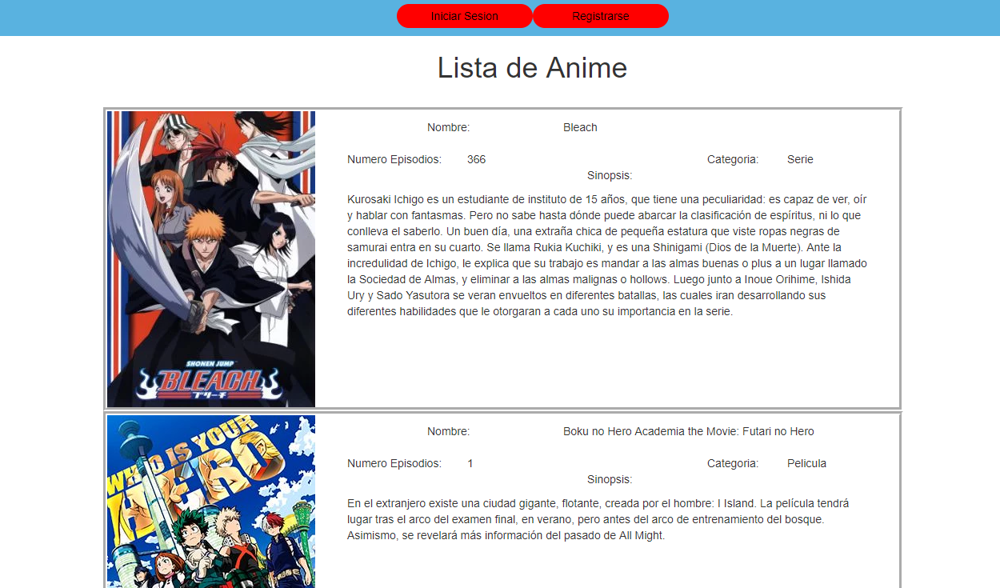
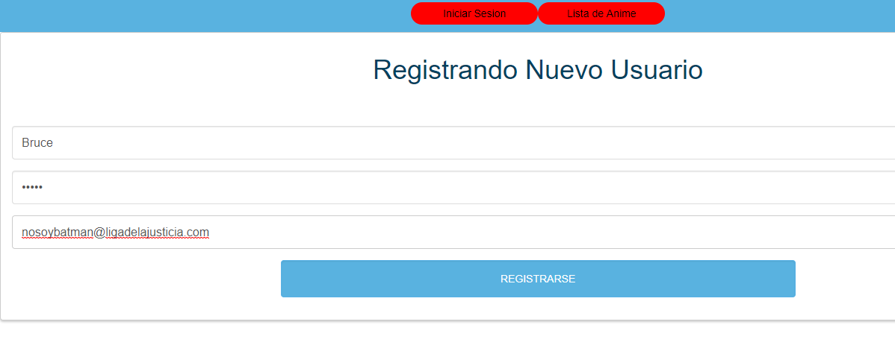
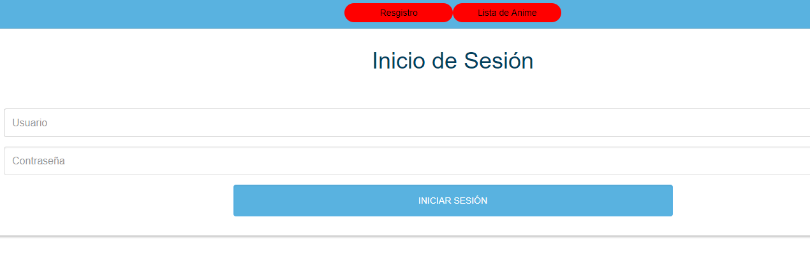
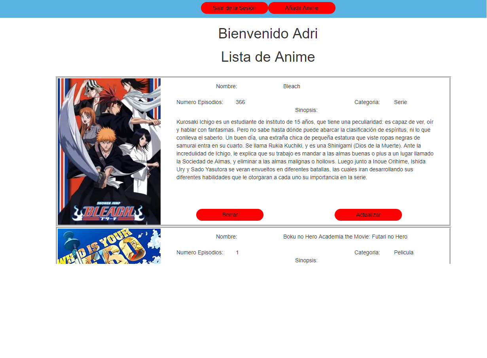
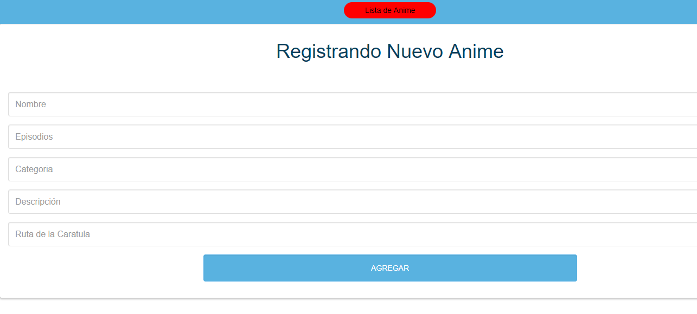
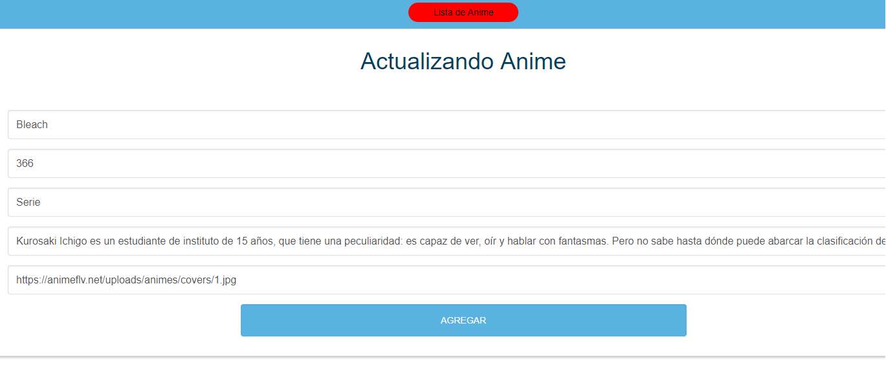

# PHP-AnimeList

**Pantalla de Inicio**

En la cual nosotros podremos crear un nuevo usuario o registrarnos con uno ya existente

**Pantalla de Registro**

Esta es la pantalla que aparecera si pulsamos el botón de Registrarse

**Pantalla de Inicio de Sesión**

Esta es la pantalla que aparecera si pulsamos el botón de Inicio de Sesión.

**Pantalla Una vez el Usuario este Registrado**

Muestra un Bienvenido con el nombre del Usuario

**Pantalla de Registro de Nuevo Anime**

**Pantalla de Actualización de Anime**

Aqui nos manda al querer actualizar un anime.

